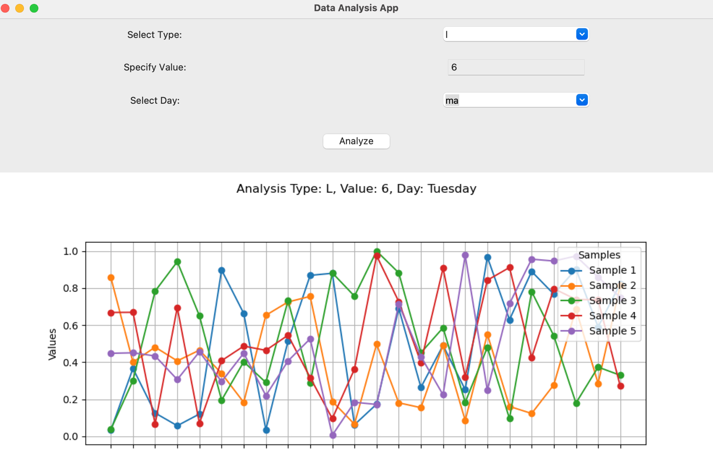

# Public Transport Passengers on Board Analytics

This Python-based project provides data analytics for monitoring the number of passengers on board buses in the city of Cagliari. It aims to offer insights into passenger behavior and bus occupancy levels, focusing on identifying patterns during rush hours and various intervals throughout the day.

## Features

- **Bus Line Analysis**: Select a specific bus line to analyze passenger counts.
- **Time-Interval Sampling**: Data is sampled every 15 minutes, providing detailed occupancy trends.
- **Day Specific Trends**: Analyze passenger recursivity on board through rush hours on specific days (e.g., comparing all Mondays over two months).
- **Interactive GUI**: A user-friendly graphical interface allows for easy selection of parameters and displays results through intuitive graphs.

### GUI Preview

Here's a preview of the graphical user interface for the analytics app:



### Example of Analyzed Data

The following graph illustrates an example analysis carried out by the program. In this case, the analysis focuses on a particular bus line, showing the occupancy trends at different times of the day. The X-axis represents time in 15-minute intervals, while the Y-axis shows the number of passengers on board.


## Installation Instructions

Ensure you have Python installed on your machine. This project requires the following Python packages: NumPy, Pandas, and Matplotlib. You can install these packages using the following pip command:

```bash
pip install numpy pandas matplotlib tkinter
```

----------

# Usage

After installing the necessary Python packages, you can run the program by executing the main script. The GUI will prompt you to select analysis parameters such as the bus line and date range. After making your selection, the program will generate and display the occupancy trends graph.
